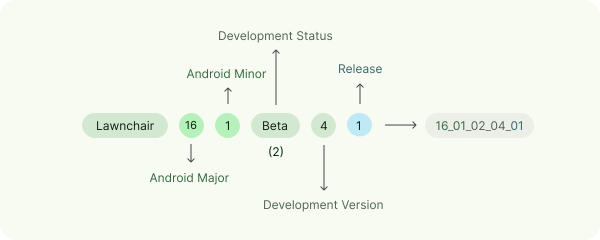

# Development workflow

Lawnchair utilizes a tiered workflow to balance development velocity with system stability. All pull requests (PRs) must target the `16-dev` branch unless otherwise specified.

### Change tiers

The complexity and risk of a change determine the review protocol.

<table><thead><tr><th width="95">Tier</th><th>Definition</th><th>Examples</th><th>Protocol</th></tr></thead><tbody><tr><td><strong>Trivial</strong></td><td>Zero risk of regression.</td><td>Typos, documentation, style fixes.</td><td>Commit directly to the active branch.</td></tr><tr><td><strong>Simple</strong></td><td>Functionally isolated changes with low risk.</td><td>Single-file bug fixes, minor UI polish.</td><td>Create PR, assign reviewer, enable auto-merge.</td></tr><tr><td><strong>Medium</strong></td><td>Changes affecting multiple components.</td><td>New settings screens, drawer search providers.</td><td>Detailed PR, requires core team review.</td></tr><tr><td><strong>Major</strong></td><td>High-risk, core architectural changes.</td><td>Android version rebases, subsystem rewrites.</td><td>Detailed PR, mandatory formal approval required.</td></tr></tbody></table>

### Commit conventions

We follow the [Conventional Commits](https://www.conventionalcommits.org/en/v1.0.0/) specification. Commits should use the following format: `type(scope): subject`.

Allowed types include: `feat`, `fix`, `style`, `refactor`, `perf`, `docs`, `test`, and `chore`.

### Versioning scheme

Lawnchair version codes utilize a five-part structure to ensure compatibility and track development stages.

<picture>
    <source media="(prefers-color-scheme: dark)" srcset="../.gitbook/assets/version-dark.svg" width="98%">
    
    <!-- Direct the accessibility reader to read the point below --->
</picture>

1. **Android major version**
2. **Android minor version**
3. **Development stage** (00: Dev, 01: Alpha, 02: Beta, 03: RC, 04: Release)
4. **Development version**
5. **Revision number**

The following table lists the development stages used by Lawnchair:

<table><thead><tr><th width="166">Stage</th><th width="126">Denoted by</th></tr></thead><tbody><tr><td>Development</td><td>00</td></tr><tr><td>Alpha</td><td>01</td></tr><tr><td>Beta</td><td>02</td></tr><tr><td>Release Candidate</td><td>03</td></tr><tr><td>Release</td><td>04</td></tr></tbody></table>
